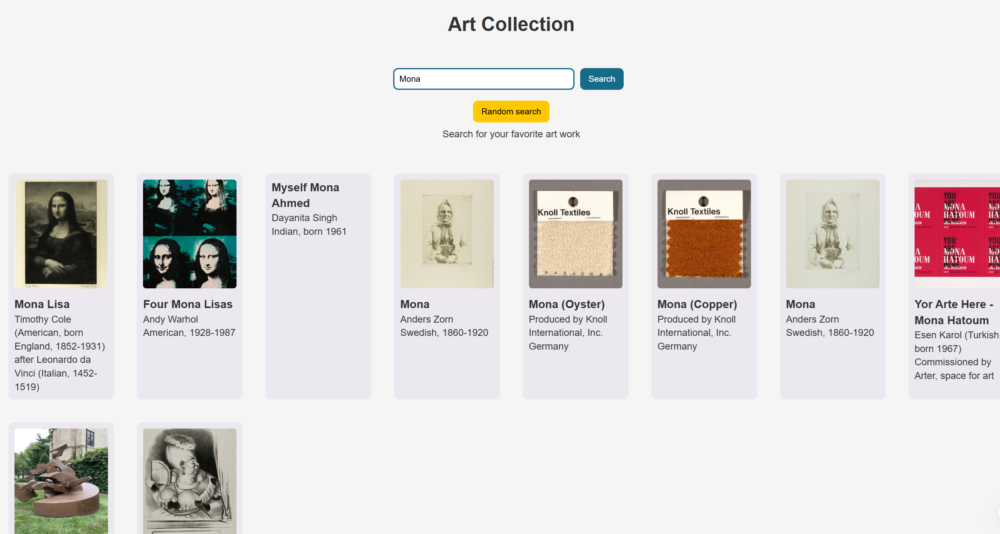

# mod-4-project

## Beyond Display

### Project Summary

Beyond Display is a responsive paintings gallery application that allows users to browse, search, and explore artwork from the Art Institute of Chicago’s public collection. The application integrates with the Art Institute of Chicago API to dynamically fetch and display artwork data, including images, titles, artists, descriptions, and historical details.This is a paintings gallery.

The goal of this project is to create an interactive and user-friendly gallery experience while practicing API integration, asynchronous JavaScript, and responsive frontend development.

### Team Members

- Sina

- Julio

### API Integration

This project integrates with the Art Institute of Chicago API.

Base API: https://api.artic.edu/api/v1/artworks.

### Endpoints Used

#### Fetch All Public Domain Artwork

https://api.artic.edu/api/v1/artworks?fields=id,title,artist_display,image_id&is_public_domain=true

#### Fetch Single Artwork by ID

https://api.artic.edu/api/v1/artworks/${id}?fields=id,title,image_id,artist_display,fiscal_year,artwork_type_title,credit_line,description,place_of_origin

#### Search for artwork

https://api.artic.edu/api/v1/artworks/search?q=${encodeURIComponent(query)}&fields=id,title,artist_display,image_id

### Features

MVP (Minimum Viable Product)

- Display a gallery of public domain artworks

- Render artwork image, title, and artist name

- Search functionality for paintings by keyword

- View detailed information for a selected artwork

* Responsive layout for mobile, tablet, and desktop devices

* Asynchronous data fetching using JavaScript (async/await)

Stretch Features

- Loading states for improved user experience

- Error handling for failed API requests

- Dynamic routing for artwork detail pages

- Improved filtering or sorting functionality

- Enhanced UI interactions and animations

### Usage

Select a painting you want to see more information about clicking on it

You can click close to get out of the image

You can also search for a collection of paintings using the search function

Can click the random search to get one painting random from the collection

### Setup Instructions

1. Clone the repository:
   - Git clone `<repository-url>`

2. Navigate into the project directory:
   - cd into src or right-click open in integrated terminal

3. Install dependencies:
   - npm i

4. Start development server:
   - npm run dev

5. Open the app in your browser:
   - Click the link that apears after typing npm run dev

### Technologies used

- JavaScript (ES6+)

- HTML5

* CSS3

* REST API integration

* Async/Await

* Git

* GitHub
